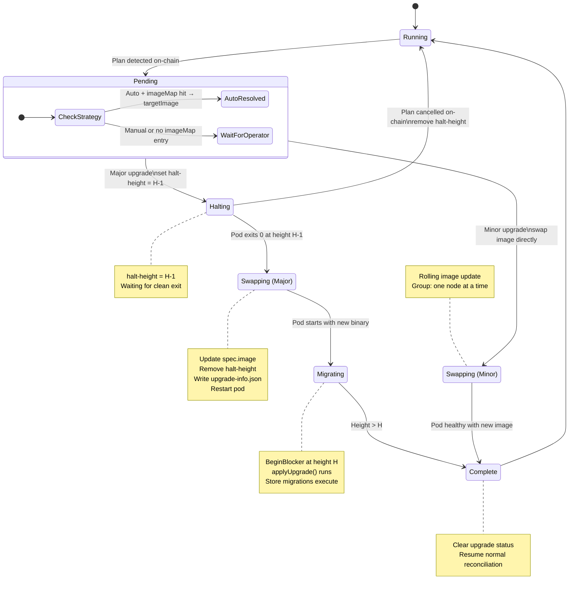

# Component: Automated Network Upgrades

**Date:** 2026-03-22
**Status:** Draft — Technical Direction

---

## Owner

Platform / Infrastructure

## Phase

Pre-Tide — Operational prerequisite. Network upgrades are the most coordination-intensive event in a Cosmos chain's lifecycle. Automating them via the controller is required before the Kubernetes infrastructure can be considered production-grade.

## Purpose

Enable the `sei-k8s-controller` to orchestrate governance-driven software upgrades across managed `SeiNode` and `SeiNodeDeployment` resources. The orchestration must handle both **major** (hard stop at a block height) and **minor** (rolling, pre-height) upgrades with zero missed blocks beyond the mandatory consensus halt, and zero risk of running an incompatible binary at the wrong height.

---

## Current State

### Cosmos SDK Upgrade Flow

The `x/upgrade` module is the standard mechanism for coordinated chain upgrades:

1. A `SoftwareUpgradeProposal` is submitted via governance, specifying a **name**, **height**, and **info** (JSON metadata including `upgradeType`).
2. Validators vote. If the proposal passes, the upgrade `Plan` is stored on-chain.
3. At block height H, the upgrade module's `BeginBlocker` checks the plan:
   - If **no handler** is registered for the plan name → the node **panics** (writes `upgrade-info.json` to disk, logs `UPGRADE "<name>" NEEDED`, then crashes). This is the halt signal.
   - If a **handler IS registered** → the node runs migrations (`applyUpgrade()`) and continues. No halt.
4. The operator's job: replace the binary before the node restarts so the handler is present.

| Upgrade Type | Behavior | Operator Window |
|---|---|---|
| **Major** (`upgradeType: "major"`) | Running the new binary before height H causes a panic (`BINARY UPDATED BEFORE TRIGGER`). Must swap at exactly height H. | Height H only |
| **Minor** (`upgradeType: "minor"`) | Running the new binary before height H is allowed (no pre-height panic). | Any time before or at height H |

### Halt Mechanisms

| Mechanism | Trigger Point | Exit Behavior | Use Case |
|---|---|---|---|
| Upgrade module panic | `BeginBlocker` at height H | Non-zero exit (panic) | Standard governance upgrade |
| `--halt-height` flag | `Commit` after block H committed | Clean exit 0 (SIGINT/SIGTERM to self) | Controlled stops for snapshots, exports |
| `--halt-time` flag | `Commit` when block time ≥ threshold | Clean exit 0 | Time-based stops |

**Key insight:** `--halt-height` triggers during **Commit** (block is persisted), producing a clean exit. The upgrade panic triggers during **BeginBlocker** (before the block is processed), producing a crash. Using `halt-height = H - 1` to stop cleanly, then swapping the image and restarting at height H is operationally cleaner than letting the upgrade panic fire.

### Sei-Specific Upgrade Patterns

- **Handler registration**: All upgrade names are embedded in `app/tags` (104 entries from `1.0.2beta` through `v6.4.0`). Each binary "knows" all historical upgrades. New versions append to this file.
- **Store migrations**: `SetStoreUpgradeHandlers()` reads `upgrade-info.json` from disk to determine which KV stores to add/delete.
- **Hard forks**: Separate from governance — `HardForkManager` runs at exact heights for specific chain IDs. Not relevant to automated upgrades.
- **Operations today** (`sei-infra`): `upgrade-scheduler.py` estimates target height, generates `seid tx gov submit-proposal software-upgrade` commands. Monitoring alerts on `cosmos_upgrade_plan_height`. Manual binary swap on EC2.

### sei-k8s-controller Today

| Capability | Status |
|---|---|
| `spec.image` on SeiNode | Exists — controls container image |
| `spec.entrypoint` on SeiNode | Exists — controls seid start command/args |
| StatefulSet reconciliation in Running phase | **NOT IMPLEMENTED** — image changes don't roll pods after phase=Running |
| SeiNodeDeployment image push to children | Exists — pushes `image`, `entrypoint`, `sidecar` to child SeiNodes |
| `halt-height` on running pods | **NOT IMPLEMENTED** — only used in pre-init Jobs for snapshot bootstrap |
| Chain height in status | **NOT IMPLEMENTED** — `SeiNodePool.status.nodeStatuses.blockHeight` field exists but is never populated |
| Upgrade plan detection | **NOT IMPLEMENTED** — no chain RPC queries |
| Coordinated rollout across nodes | **NOT IMPLEMENTED** — SeiNodeDeployment updates all children simultaneously |

---

## Dependencies

- **On-chain**: `x/upgrade` module state (pending plan, plan height, plan name/info)
- **seid RPC**: `/abci_query` for upgrade plan, `/status` for current block height
- **Container registry**: New image must be available before upgrade height
- **seictl sidecar**: Current StatusClient already queries `/status` for height (result-export uses this)

**Explicit exclusions:**
- Cosmovisor — replaced by controller-managed image swap
- Manual operator intervention for the binary swap — automated by the controller
- Hard fork management — separate mechanism, out of scope

---

## Interface Specification

### New CRD Fields

#### `SeiNodeSpec` additions

```go
// UpgradePolicy controls how the controller handles on-chain software upgrades.
// +optional
type UpgradePolicy struct {
    // Strategy determines the upgrade orchestration mode.
    // "Auto" — controller detects on-chain proposals, halts at upgrade height,
    //          swaps image, and restarts automatically.
    // "Manual" — controller detects proposals and reports them in status,
    //            but waits for the operator to update spec.image.
    // Default: "Manual"
    // +optional
    Strategy UpgradeStrategy `json:"strategy,omitempty"`

    // ImageMap maps upgrade plan names to container images.
    // When strategy is "Auto", the controller looks up the plan name here
    // to determine the target image. If the plan name is not found,
    // the controller falls back to "Manual" behavior for that upgrade.
    // +optional
    ImageMap map[string]string `json:"imageMap,omitempty"`
}

type UpgradeStrategy string

const (
    UpgradeStrategyManual UpgradeStrategy = "Manual"
    UpgradeStrategyAuto   UpgradeStrategy = "Auto"
)
```

#### `SeiNodeStatus` additions

```go
// UpgradeStatus reports the current state of any pending or in-progress upgrade.
// +optional
type UpgradeStatus struct {
    // PendingPlan is the currently scheduled on-chain upgrade plan, if any.
    // +optional
    PendingPlan *UpgradePlanInfo `json:"pendingPlan,omitempty"`

    // Phase is the current upgrade orchestration state.
    // Empty when no upgrade is in progress.
    // +optional
    Phase UpgradePhase `json:"phase,omitempty"`

    // TargetImage is the image the controller will use after the upgrade.
    // Set when strategy is "Auto" and the plan name is found in imageMap.
    // +optional
    TargetImage string `json:"targetImage,omitempty"`
}

type UpgradePlanInfo struct {
    Name   string `json:"name"`
    Height int64  `json:"height"`
    Info   string `json:"info,omitempty"`
}

type UpgradePhase string

const (
    UpgradePhaseNone        UpgradePhase = ""
    UpgradePhasePending     UpgradePhase = "Pending"     // Plan detected, waiting for height
    UpgradePhaseHalting     UpgradePhase = "Halting"      // halt-height set, waiting for clean stop
    UpgradePhaseSwapping    UpgradePhase = "Swapping"     // Pod stopped, updating image
    UpgradePhaseMigrating   UpgradePhase = "Migrating"    // New binary running, executing migrations
    UpgradePhaseComplete    UpgradePhase = "Complete"      // Upgrade finished, back to normal
)
```

#### `SeiNodeStatus` — observed chain state

```go
// ChainStatus reports the node's observed chain state, populated from sidecar RPC queries.
// +optional
type ChainStatus struct {
    // BlockHeight is the latest committed block height.
    // +optional
    BlockHeight int64 `json:"blockHeight,omitempty"`

    // BlockTime is the timestamp of the latest committed block.
    // +optional
    BlockTime *metav1.Time `json:"blockTime,omitempty"`
}
```

### SeiNodeDeployment Upgrade Coordination

```go
// SeiNodeDeploymentSpec additions
type GroupUpgradePolicy struct {
    // Strategy inherited by all child SeiNodes unless overridden.
    // +optional
    Strategy UpgradeStrategy `json:"strategy,omitempty"`

    // ImageMap inherited by all child SeiNodes.
    // +optional
    ImageMap map[string]string `json:"imageMap,omitempty"`

    // MinorStrategy controls how minor upgrades are rolled out across the group.
    // "Rolling" — update nodes one at a time, waiting for each to become healthy.
    // "AllAtOnce" — update all nodes simultaneously.
    // Default: "Rolling"
    // +optional
    MinorStrategy GroupRolloutStrategy `json:"minorStrategy,omitempty"`
}

type GroupRolloutStrategy string

const (
    GroupRolloutRolling   GroupRolloutStrategy = "Rolling"
    GroupRolloutAllAtOnce GroupRolloutStrategy = "AllAtOnce"
)
```

### Controller → Sidecar Interface

The sidecar already queries `/status` for result-export. Extend the status polling to also query the upgrade module:

```
GET /abci_query?path="custom/upgrade/plan"
```

Response: the pending `Plan` proto, or empty if no plan is scheduled.

The controller reads this from the sidecar's status report (extend `ConfigStatus` or add a new status endpoint). Alternatively, the controller can query the node's RPC directly.

### Error Conditions

| Error | Cause | Detection | Response |
|---|---|---|---|
| Image not found in registry | `imageMap` points to non-existent tag | Pod `ImagePullBackOff` | Emit event, set upgrade phase to `Pending`, do not proceed |
| Plan name not in `imageMap` | New upgrade proposed but operator hasn't updated map | Plan detected, lookup misses | Set upgrade phase to `Pending`, emit warning event, fallback to Manual |
| Node crashes before halt-height | Unrelated crash during upgrade window | Pod restart, height < plan height | Controller re-applies halt-height on restart |
| Node doesn't halt at expected height | `halt-height` not applied or race condition | Height advances past H-1 without clean exit | Let upgrade panic fire (fallback), controller detects non-zero exit and swaps image |
| Upgrade migrations fail | New binary panics during `applyUpgrade()` | Pod CrashLoopBackOff at height H | Emit event, set phase to Failed, require manual intervention |
| Chain halt (< 2/3 voting power) | Not enough validators upgrade | Block production stops | Out of scope — monitoring/alerting concern |

---

## State Model

### Upgrade State Machine (per SeiNode)



### State Storage

| State | Location | Source of Truth |
|---|---|---|
| Pending upgrade plan | On-chain (`x/upgrade` store) | Chain |
| Observed plan + phase | `SeiNode.status.upgrade` | Controller |
| Target image | `SeiNode.status.upgrade.targetImage` (resolved from `spec.upgradePolicy.imageMap`) | CRD |
| Current block height | `SeiNode.status.chain.blockHeight` | Chain via RPC |
| Image map | `SeiNode.spec.upgradePolicy.imageMap` or `SeiNodeDeployment.spec.upgradePolicy.imageMap` | Operator-managed |

---

## Internal Design

### 1. Upgrade Detection (reconcileRunning extension)

Every reconciliation cycle for a Running node:

```
1. Query node RPC for current block height → update status.chain.blockHeight
2. Query node RPC for pending upgrade plan
3. If plan exists and status.upgrade.phase == "":
   a. Set status.upgrade.pendingPlan = {name, height, info}
   b. Parse plan.Info for upgradeType
   c. If spec.upgradePolicy.strategy == "Auto":
      - Look up plan.Name in spec.upgradePolicy.imageMap
      - If found: set status.upgrade.targetImage, phase = "Pending"
      - If not found: phase = "Pending", emit warning event
   d. If strategy == "Manual": phase = "Pending", emit event
4. Requeue with appropriate interval (shorter as height approaches)
```

### 2. Major Upgrade Orchestration

When `status.upgrade.phase == "Pending"` and upgrade is major:

```
1. Calculate blocks remaining = plan.Height - status.chain.blockHeight
2. If blocks remaining <= haltWindow (configurable, default 100):
   a. Inject --halt-height=<plan.Height - 1> into the pod
   b. Set phase = "Halting"
   c. Requeue frequently (every 5s)
3. When pod exits cleanly (exit 0) at height H-1:
   a. Update spec.image to status.upgrade.targetImage
   b. Remove halt-height from entrypoint
   c. Set phase = "Swapping"
   d. Reconcile StatefulSet (trigger pod replacement)
4. When new pod is Running and height >= H:
   a. Set phase = "Complete"
   b. Clear upgrade status on next reconcile
```

**Injecting halt-height:** The cleanest mechanism is patching `spec.entrypoint.args` to append `--halt-height=<H-1>`. When the upgrade completes, the controller removes it. An alternative is a dedicated `spec.haltHeight` field.

### 3. Minor Upgrade Orchestration

When upgrade is minor and strategy is Auto:

```
1. Update spec.image to targetImage immediately (no halt needed)
2. Reconcile StatefulSet (triggers rolling restart)
3. For SeiNodeDeployment with minorStrategy=Rolling:
   a. Update one child SeiNode's image at a time
   b. Wait for it to reach Running and height > plan.Height
   c. Proceed to next node
4. Set phase = "Complete" when all nodes are updated
```

### 4. Prerequisite: StatefulSet Reconciliation in Running Phase

The current controller does **not** reconcile the StatefulSet after `phase=Running`. This must be fixed:

```go
func (r *SeiNodeReconciler) reconcileRunning(ctx context.Context, node *seiv1alpha1.SeiNode) (ctrl.Result, error) {
    // Existing: reconcileRuntimeTasks(...)

    // NEW: reconcile StatefulSet spec to pick up image/entrypoint changes
    if err := r.reconcileNodeStatefulSet(ctx, node); err != nil {
        return ctrl.Result{}, err
    }

    // NEW: upgrade detection and orchestration
    if err := r.reconcileUpgrade(ctx, node); err != nil {
        return ctrl.Result{}, err
    }

    return ctrl.Result{RequeueAfter: 30 * time.Second}, nil
}
```

### 5. SeiNodeDeployment Coordination

For major upgrades, all nodes must halt at the same height. The group controller:

```
1. Detects upgrade from any child's status.upgrade.pendingPlan
2. Pushes imageMap and strategy to all children (if not already set)
3. All children independently halt at H-1 and swap
4. Group reports upgrade complete when all children are past height H
```

For minor upgrades with Rolling strategy:

```
1. Group maintains an ordered list of children
2. Updates one child's image at a time
3. Waits for health check before proceeding
4. Respects PodDisruptionBudget if configured
```

---

## Error Handling

| Error Case | Detection | Controller Response | Operator Action |
|---|---|---|---|
| Upgrade plan detected, no imageMap entry | Plan name lookup miss | Emit `UpgradeImageNotMapped` event, stay in Pending | Add entry to `imageMap` with target image |
| Image pull failure | Pod enters `ImagePullBackOff` | Emit `UpgradeImagePullFailed` event, stay in Swapping | Fix image reference in `imageMap` |
| Node doesn't halt cleanly | Pod still running past H-1 | Increase requeue frequency, let upgrade panic fire as fallback | None — controller handles crash restart |
| Upgrade migration panic | Pod `CrashLoopBackOff` at height H | Emit `UpgradeMigrationFailed` event, set phase to Failed | Investigate migration failure, may need `--unsafe-skip-upgrades` |
| Chain halted (consensus failure) | No height advancement across all nodes | Emit `ChainHalted` event | Coordinate with other validators off-band |
| Partial group upgrade | Some children complete, others stuck | Group status shows mixed phases | Investigate stuck nodes individually |
| Manual strategy — operator slow | Height approaching, no image update | Emit escalating warning events | Update `spec.image` before height H |

---

## Test Specification

### Unit Tests

| Test | Setup | Action | Expected |
|---|---|---|---|
| `TestUpgradeDetection_PlanFound` | Mock RPC returns pending plan at height 1000 | Reconcile running node | `status.upgrade.pendingPlan` populated, phase=Pending |
| `TestUpgradeDetection_NoPlan` | Mock RPC returns no plan | Reconcile running node | `status.upgrade` empty |
| `TestMajorUpgrade_HaltHeightInjected` | Node at height 900, plan at 1000, haltWindow=100 | Reconcile | `entrypoint.args` includes `--halt-height=999` |
| `TestMajorUpgrade_HaltHeightNotYet` | Node at height 800, plan at 1000, haltWindow=100 | Reconcile | No halt-height injection, phase stays Pending |
| `TestMajorUpgrade_PodExitedCleanly` | Phase=Halting, pod terminated with exit 0 | Reconcile | Image updated to targetImage, phase=Swapping |
| `TestMinorUpgrade_ImmediateSwap` | Minor plan detected, Auto strategy, imageMap hit | Reconcile | Image updated immediately, no halt-height |
| `TestImageMapMiss` | Plan name "v7.0.0" not in imageMap | Reconcile | Warning event emitted, phase=Pending, no swap |
| `TestManualStrategy_NoAutoSwap` | Manual strategy, plan detected | Reconcile | Phase=Pending, image NOT updated, event emitted |
| `TestStatefulSetReconciledInRunning` | Phase=Running, spec.image changed | Reconcile | StatefulSet updated with new image |

### Integration Tests

| Test | Setup | Action | Expected |
|---|---|---|---|
| `TestMajorUpgradeE2E` | SeiNode running at height H-10, plan at H, Auto strategy with imageMap | Wait for height approach | Node halts at H-1, restarts with new image, resumes at H |
| `TestGroupMajorUpgrade` | SeiNodeDeployment with 3 nodes, all detect same plan | Wait | All nodes halt at H-1, all swap, all resume |
| `TestGroupMinorRolling` | SeiNodeDeployment with 3 nodes, minor plan, Rolling | Trigger | Nodes updated one at a time, each healthy before next |
| `TestUpgradePanicFallback` | halt-height injection fails, node crashes at H | Reconcile after crash | Controller detects crash, swaps image, pod restarts successfully |

---

## Deployment

### Implementation Order

1. **Phase 1 — Foundation**: Populate `status.chain.blockHeight` from sidecar RPC. Reconcile StatefulSet in Running phase. These are prerequisites with value independent of upgrades.
2. **Phase 2 — Detection**: Add `UpgradePolicy` and `UpgradeStatus` CRD fields. Implement upgrade plan detection via RPC. Manual strategy only.
3. **Phase 3 — Major Auto**: Implement halt-height injection, image swap, and the full major upgrade state machine.
4. **Phase 4 — Minor + Group**: Implement minor rolling upgrades and SeiNodeDeployment coordination.

### Testnet vs Mainnet

| Aspect | Testnet | Mainnet |
|---|---|---|
| Strategy default | Auto | Manual |
| haltWindow | 50 blocks | 200 blocks |
| imageMap population | Automated from CI/CD pipeline | Reviewed and approved by operator |
| Monitoring | Standard alerts | Enhanced: `UpgradeApproaching`, `UpgradeStalled`, `ChainHalted` |

---

## Decision Log

| # | Decision | Rationale | Reversibility |
|---|---|---|---|
| 1 | Use `halt-height` for clean stops instead of letting the upgrade panic fire | Clean exit (code 0) is operationally safer than a panic crash. Controller can distinguish "halted for upgrade" from "crashed". Kubernetes restart policies don't interfere. | Two-way door: can always fall back to letting the panic fire |
| 2 | `imageMap` on CRD rather than auto-discovering images | Container image tags are not derivable from on-chain plan names. The mapping is organizational convention, not protocol. Explicit mapping prevents deploying the wrong image. | Two-way door: can add auto-discovery later as a convenience layer |
| 3 | Manual strategy as default | Mainnet upgrades are high-stakes events. Auto mode should be opt-in after operators gain confidence. | Two-way door: change the default |
| 4 | Reconcile StatefulSet in Running phase | Required for upgrades but also fixes a general gap where spec changes don't propagate to running pods. | Two-way door: scope can be narrowed to upgrade-only fields |
| 5 | Major upgrades halt at H-1, not H | `halt-height` triggers during Commit, so block H-1 is committed and persisted. On restart at block H, the upgrade handler runs in BeginBlocker. This is the standard Cosmovisor-equivalent flow. | One-way door (operationally): changing halt target after deployment requires careful coordination. But the flag value itself is a two-way door. |

---

## Deferred (Do Not Build)

| Feature | Rationale |
|---|---|
| **Cosmovisor integration** | Controller replaces Cosmovisor's role. No need for both. |
| **Automatic image building** | Out of scope — CI/CD concern. Controller consumes pre-built images. |
| **Governance proposal submission** | Controller is an observer/executor, not a governance participant. |
| **Hard fork management** | Separate mechanism with chain-ID-specific logic. Not governance-driven. |
| **Cross-chain upgrade coordination** | Single chain per SeiNodeDeployment. Multi-chain is future work. |
| **Rollback automation** | Cosmos upgrades are forward-only. Rollback requires governance cancel + manual intervention. |
| **Auto-discovery of image from plan.Info URL** | Cosmovisor supports download URLs in plan.Info, but pulling arbitrary binaries into containers is an anti-pattern in Kubernetes. Use imageMap instead. |
