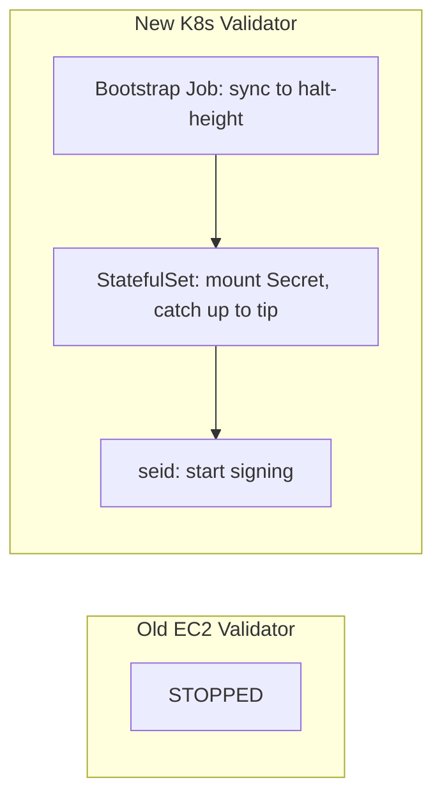
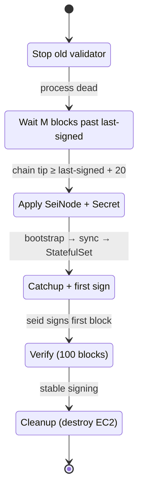

# Component: Validator Migration (sei-infra → sei-k8s-controller)

**Date:** 2026-03-22
**Status:** Draft — Technical Direction

---

## Owner

Platform / Infrastructure

## Phase

Pre-Tide — Operational prerequisite. Validator availability is a hard requirement for chain liveness; this migration must complete before any Tide workloads depend on the chain.

## Purpose

Migrate Sei's consensus-participating validators from the current EC2/Terraform infrastructure (`sei-infra`) onto the Kubernetes-native `SeiNode` controller. The migration must preserve validator uptime and signing continuity with **zero risk of double-signing or slashing**.

**Key constraint:** At a coordinated block height, validators must begin signing blocks on the new infrastructure and must under no circumstance sign blocks on both old and new infrastructure simultaneously.

---

## Current State

### sei-infra Validators (EC2)

| Property | Value |
|----------|-------|
| Infrastructure | EC2 instances managed by Terraform |
| Chains | pacific-1 (2 validators), arctic-1 (30 validators) |
| Instance types | m5.4xlarge, c5.4xlarge, r5.4xlarge |
| Storage | 200 GB root + variable data (gp3) |
| Bootstrap | `init_configure.sh` → `seid init`, mode=validator, genesis ceremony via S3 |
| Key management | `priv_validator_key.json` generated on-host, backed up to S3 |
| Key artifacts | `priv_validator_key.json`, `priv_validator_state.json`, `node_key.json` |
| Peer discovery | `persistent_peers.sh` resolves peers from S3-published node IDs |
| Monitoring | Prometheus with EC2 service discovery |

### sei-k8s-controller Validators (Kubernetes)

| Property | Value |
|----------|-------|
| CRD | `ValidatorSpec` with `Peers` and `Snapshot` fields |
| Planner | Sets `mode = "validator"` via sei-config; shares full-node bootstrap |
| Key management | None — no key import, creation, or reference in the spec |
| Sentry/double-sign | Not implemented |
| Sample manifests | None |

---

## Threat Model

### T1: Double Signing (Slashing — Catastrophic)

If the old and new validator instances both have the same `priv_validator_key.json` and are running simultaneously, they will sign conflicting blocks at the same height. This triggers on-chain slashing (typically 5% stake for Cosmos SDK chains) and is **irreversible**.

**Mitigation:** Hard cutover at a coordinated block height. The old instance must be stopped (and confirmed stopped) before the new instance starts signing. The `priv_validator_state.json` must be transferred to prevent signing at any previously-signed height.

### T2: Missed Blocks (Jailing — Recoverable but Costly)

If the new instance takes too long to start signing after the old one stops, the validator misses blocks and may be jailed for downtime. Jailing is recoverable (unjail tx), but extended downtime damages reputation and may result in delegation loss.

**Mitigation:** Minimize the cutover window. Pre-sync the new instance to near-tip before stopping the old one. Target cutover window < 30 seconds.

### T3: State Corruption During Transfer

If `priv_validator_state.json` is not transferred or is stale, the new instance may re-sign a height it already signed on the old instance (→ T1), or refuse to sign because its state is ahead of the chain.

**Mitigation:** Stop old instance → copy latest `priv_validator_state.json` → start new instance. The state file is the single source of truth for what has been signed.

### T4: Network Partition During Cutover

If the new instance cannot reach peers immediately after cutover, it will miss blocks even though it's ready to sign.

**Mitigation:** Pre-configure peers and verify connectivity before cutover. The new instance should be fully synced and peered before the signing key is activated.

---

## Migration Strategy: Single-Shot Deployment

The migration uses a **stop-old → deploy-new** pattern. The old EC2 validator stops, the operator scrapes its `priv_validator_key.json`, and a new K8s `SeiNode` is deployed with both a bootstrap snapshot configuration and the scraped key already mounted via Secret. The new validator starts signing once it catches up to chain tip.

`priv_validator_state.json` is not transferred — CometBFT auto-creates it on first start, and the "wait M blocks past last-signed height" step before deployment provides the slashing-protection envelope (see §Slashing protection below).

### Phase 1: Stop the Old Validator

Stop the EC2 validator and confirm the process is dead. From this point onward, the validator is offline; downtime ends when the K8s validator catches up and begins signing.

### Phase 2: Wait for Chain Advance

Wait until on-chain consensus has advanced ≥ M blocks past the old validator's last-signed height (M=20 is sufficient for Sei). This window is the slashing-protection envelope — once the chain is well past the old validator's last signed height, the K8s validator's first signing opportunity at chain tip cannot collide with anything the old validator signed, even under a re-org at the cutover boundary.

### Phase 3: Deploy New SeiNode

Scrape `priv_validator_key.json` from the EC2 host, create a Kubernetes Secret containing it, and apply a `SeiNode` manifest with both `validator.snapshot.bootstrapImage` (for sync) and `validator.signingKey.secret.secretName` (for signing).



**Downtime envelope:** the bootstrap Job's snapshot-restore + sync-to-halt-height time, plus the production StatefulSet's catch-up from halt-height to current tip. For arctic-1 testnet this is acceptable. Pacific-1 deployments may want the deferred zero-downtime variant — see §Deferred.

### Phase 4: Verification

After signing begins:
- Confirm new instance is signing blocks (check `signing_info` on-chain)
- Confirm old instance is stopped and stays stopped
- Monitor for missed blocks over next 100 blocks
- Remove old EC2 instance from Terraform state (do NOT destroy yet — keep as cold backup)

### Phase 5: Cleanup

After 1000+ blocks with stable signing on new infrastructure:
- Destroy old EC2 instance
- Remove `priv_validator_key.json` from any S3 backups (or rotate)

---

## Controller Changes Required

### 1. Key Import Mechanism

The controller needs a way to inject `priv_validator_key.json` and `priv_validator_state.json` into the validator's data directory. Options:

**Option A: Kubernetes Secret + Volume Mount**

```yaml
spec:
  validator:
    signingKey:
      secretRef:
        name: pacific-1-validator-0-keys
        # Contains: priv_validator_key.json, priv_validator_state.json
```

The controller mounts the Secret as a volume into the seid container at the expected config path. The Secret is created out-of-band (manually or via External Secrets Operator from AWS Secrets Manager).

- Pro: Standard K8s pattern, integrates with external secret stores
- Pro: Keys never pass through the controller binary
- Con: Secret lifecycle management is manual

**Option B: Sidecar Task (`import-validator-keys`)**

A new sidecar task that downloads keys from S3/Secrets Manager and writes them to the data directory during init.

- Pro: Consistent with existing sidecar task model
- Con: Keys transit through sidecar process
- Con: New task type to implement and test

**Recommendation: Option A** — simpler, more secure (keys never in controller or sidecar memory), standard Kubernetes pattern. The Secret can be sourced from AWS Secrets Manager via the CSI driver or External Secrets Operator.

### 2. ValidatorSpec Extension

```go
type ValidatorSpec struct {
    Peers    []PeerSource    `json:"peers,omitempty"`
    Snapshot *SnapshotSource `json:"snapshot,omitempty"`

    // SigningKey references a Secret containing priv_validator_key.json
    // and priv_validator_state.json. When set, the controller mounts
    // the Secret into the seid container's config directory.
    // +optional
    SigningKey *SigningKeySource `json:"signingKey,omitempty"`
}

type SigningKeySource struct {
    // SecretRef is a reference to a Kubernetes Secret in the same namespace
    // containing the validator's signing key material.
    SecretRef corev1.LocalObjectReference `json:"secretRef"`
}
```

### 3. Resource Generation Changes

When `SigningKey` is set, the StatefulSet pod spec must:
- Mount the referenced Secret as a volume
- Map `priv_validator_key.json` → `$HOME/.sei/config/priv_validator_key.json`
- Map `priv_validator_state.json` → `$HOME/.sei/data/priv_validator_state.json`

The init container (`seid init`) must not overwrite these files if they already exist from the Secret mount.

---

## Cutover Runbook (per validator)

### Prerequisites

- [ ] Old EC2 validator is running and signing normally
- [ ] Operator has SSH access to old EC2 instance
- [ ] Operator has kubectl access to target cluster
- [ ] K8s `SeiNode` manifest is prepared with `validator.snapshot.bootstrapImage`, `validator.snapshot.s3.targetHeight`, and `validator.signingKey.secret.secretName` set, but NOT yet applied
- [ ] K8s Secret for the signing key does NOT exist yet

### Execution

```bash
# 1. Stop old EC2 validator (THE POINT OF NO RETURN — downtime begins here)
ssh validator-0.ec2 'sudo systemctl stop seid && sudo systemctl disable seid'
ssh validator-0.ec2 'pgrep seid'  # must return nothing

# 2. Note last-signed height for the slashing-protection wait
LAST_HEIGHT=$(ssh validator-0.ec2 'cat /sei/data/priv_validator_state.json | jq -r .height')
echo "Old validator last-signed height: $LAST_HEIGHT"

# 3. Wait for chain to advance ≥ 20 blocks past LAST_HEIGHT
#    (defends against re-org at the cutover boundary; chain tip queries via any RPC peer)
while true; do
  TIP=$(curl -s https://sei-rpc.example.com/status | jq -r .result.sync_info.latest_block_height)
  if [ "$TIP" -ge "$((LAST_HEIGHT + 20))" ]; then break; fi
  sleep 5
done

# 4. Scrape the consensus key from the (now-stopped) old instance
ssh validator-0.ec2 'cat /sei/config/priv_validator_key.json' > /tmp/priv_validator_key.json

# 5. Create the K8s Secret holding ONLY priv_validator_key.json
#    (priv_validator_state.json is NOT injected — CometBFT auto-creates it; the
#    M-block wait above is the operational protection)
kubectl create secret generic pacific-1-validator-0-key \
  --from-file=priv_validator_key.json=/tmp/priv_validator_key.json

# 6. Apply the SeiNode manifest. This kicks off bootstrap-Job → sync → StatefulSet
#    → seid signs once caught up to tip.
kubectl apply -f pacific-1-validator-0.yaml

# 7. Watch for signing
kubectl logs pacific-1-validator-0-0 -c seid -f | grep "signed proposal"

# 8. Clean up local key copy (the on-disk file IS sensitive)
shred -u /tmp/priv_validator_key.json
```

### Rollback

If the new instance fails to start signing:

```bash
# Re-enable old EC2 validator
ssh validator-0.ec2 'sudo systemctl enable seid && sudo systemctl start seid'
# Delete the K8s SeiNode and Secret
kubectl delete seinode pacific-1-validator-0
kubectl delete secret pacific-1-validator-0-key
```

The old instance will resume from its on-disk `priv_validator_state.json` (preserved on the EC2 host because we never modified it). The new K8s instance never signed unless step 7 confirmed signing — if it did, abort rollback and investigate, do NOT restart the EC2 instance.

---

## State Model



### Source of truth for signing state

| Artifact | Location | Owner |
|----------|----------|-------|
| `priv_validator_key.json` | K8s Secret (sourced from AWS Secrets Manager) | Operator |
| `priv_validator_state.json` | K8s data PVC (auto-created by seid on first start, then continuously updated) | seid process |
| Chain validator set | On-chain | Consensus |

**Slashing protection:** The K8s validator boots with a fresh `priv_validator_state.json` (height=0). Its first signing opportunity is at chain tip — which is well past the old validator's last-signed height once the M-block wait has elapsed. This is the operational equivalent of state-file transfer; the chain advancing past the old last-signed height is what makes re-signing impossible, not the file content.

---

## Error Handling

| Error | Detection | Response |
|-------|-----------|----------|
| New instance not synced at cutover time | `catching_up = true` in seid status | Abort cutover, wait for sync |
| Old instance not fully stopped | `pgrep seid` returns PID | Kill -9, verify again |
| Secret mount fails | Pod stuck in `ContainerCreating` | Check Secret exists, check RBAC |
| seid crashes on startup with keys | Pod in `CrashLoopBackOff` | Check logs, rollback to old instance |
| Double-sign detected | On-chain evidence, slashing event | **Incident.** Should never happen with this procedure. Investigate root cause. |
| Missed blocks during cutover | `signing_info` shows missed blocks | Expected for cutover window. Unjail if jailed. |

---

## Test Specification

### T1: Pre-sync mode (no signing key)

**Setup:** Deploy SeiNode with `spec.validator` and `snapshot.stateSync: {}`, no `signingKey`.
**Action:** Wait for node to sync.
**Expected:** Node syncs to tip, does not sign blocks, no `priv_validator_key.json` on disk.

### T2: Key injection via Secret mount

**Setup:** Create Secret with test `priv_validator_key.json` and `priv_validator_state.json`. Apply SeiNode with `signingKey.secretRef`.
**Action:** Pod starts.
**Expected:** Key files are present at expected paths. seid loads them without error.

### T3: Cutover simulation (testnet)

**Setup:** Two validator instances on arctic-1 — one EC2, one K8s (pre-synced, no keys).
**Action:** Execute cutover runbook.
**Expected:** < 5 missed blocks during cutover. New instance signs blocks. No double-sign evidence on-chain.

### T4: Rollback simulation

**Setup:** Same as T3, but simulate failure (kill new instance after key transfer).
**Action:** Execute rollback procedure.
**Expected:** Old instance resumes signing. No double-sign evidence.

### T5: `priv_validator_state.json` continuity

**Setup:** New instance receives state file showing last signed height H.
**Action:** New instance starts, chain is at height H+5.
**Expected:** Instance catches up and signs H+6 (or whatever the next proposal is). Does NOT attempt to sign H or earlier.

---

## Deployment

### Testnet first (arctic-1)

Arctic-1 has 30 validators. Migrate one validator at a time, starting with the least-staked. Validate the procedure and tooling before touching pacific-1.

### Mainnet (pacific-1)

Pacific-1 has 2 validators. Migrate one at a time with the full team on-call. Keep the second EC2 validator running as backup until the first K8s validator has been stable for 24+ hours.

---

## Deferred (Do Not Build)

| Feature | Rationale |
|---------|-----------|
| Zero-downtime cutover (pre-sync without keys, then patch SigningKey in mid-life) | Requires SigningKey-drift detection in `buildRunningPlan`; deferred per controller-LLD §11. Acceptable for arctic-1; reconsider for pacific-1 if downtime envelope is unacceptable. |
| HSM / remote signer integration | Not in current sei-infra; add after migration is stable |
| Sentry node topology (private validator + public sentries) | Not in current sei-infra; add as a follow-up |
| Automated cutover orchestration | Manual cutover is safer for first migration; automate after confidence |
| `priv_validator_state.json` auto-sync to Secret | seid owns the file at runtime; M-block wait before deploy is the slashing-protection envelope |
| Double-sign protection (Horcrux / TMKMS) | Valuable but not required for migration parity with sei-infra |
| Validator registration (`create-validator` tx) | Only needed for new validators; migrated validators are already registered |

---

## Decision Log

| # | Decision | Rationale | Reversibility |
|---|----------|-----------|---------------|
| 1 | Use K8s Secret for key injection (not sidecar task) | Keys never transit controller/sidecar memory; standard K8s pattern; integrates with CSI/ESO | Two-way: can switch to sidecar task later |
| 2 | Manual cutover (not automated) | Validator migration is safety-critical; human judgment for first migration reduces blast radius | Two-way: automate after first successful migration |
| 3 | Single-shot deployment (stop → wait → deploy with key) | Avoids SigningKey-drift detection complexity; trades downtime for implementation simplicity | Two-way: zero-downtime variant slots in additively if drift detection is added |
| 4 | Testnet-first rollout | Arctic-1 has 30 validators with lower stakes; validates tooling before pacific-1 | One-way in the sense that we learn from it |
| 5 | One validator at a time | Limits blast radius; chain continues with N-1 validators during cutover | Two-way: could parallelize after confidence |

---

## Open Questions

1. **Downtime envelope for pacific-1:** Single-shot deployment requires the chain to advance ≥ 20 blocks past the old validator's last-signed height before the new K8s validator can be applied, plus bootstrap-Job sync time, plus catch-up to tip. For arctic-1 testnet this is tolerable. Pacific-1's downtime budget needs measurement on a dry-run before commit.

2. **Monitoring during cutover:** What metrics/alerts should fire during the cutover window? We need to detect missed blocks in real-time, not after the fact.

3. **Pacific-1 validator count:** With only 2 validators, migrating one leaves a single point of failure. Should we stand up a temporary third validator before migration to provide a safety margin?

4. **Key rotation post-migration:** Should we rotate `priv_validator_key.json` after migration to ensure the old EC2 backup can never accidentally sign? This would require an on-chain `MsgEditValidator` with the new consensus pubkey.
