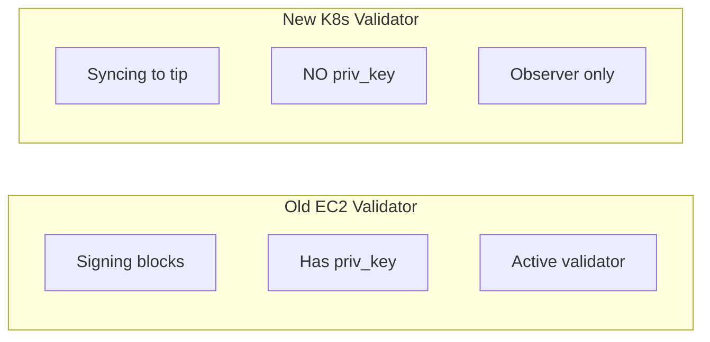
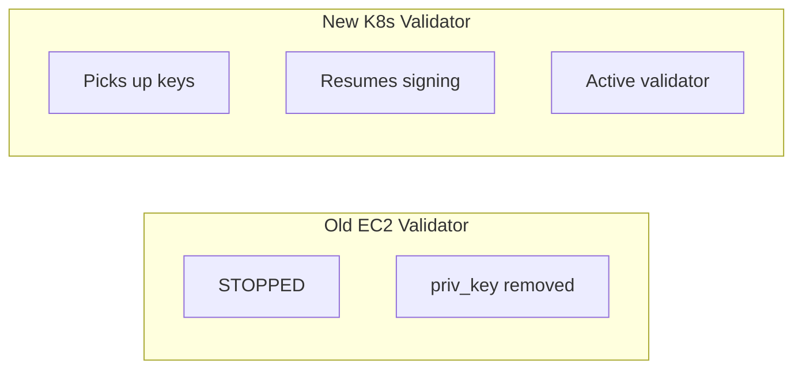
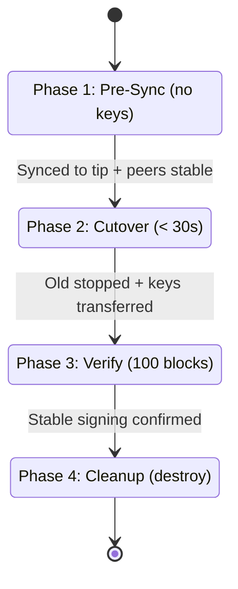

# Component: Validator Migration (sei-infra → sei-k8s-controller)

**Date:** 2026-03-22
**Status:** Draft — Technical Direction

---

## Owner

Platform / Infrastructure

## Phase

Pre-Tide — Operational prerequisite. Validator availability is a hard requirement for chain liveness; this migration must complete before any Tide workloads depend on the chain.

## Purpose

Migrate Sei's consensus-participating validators from the current EC2/Terraform infrastructure (`sei-infra`) onto the Kubernetes-native `SeiNode` controller. The migration must preserve validator uptime and signing continuity with **zero risk of double-signing or slashing**.

**Key constraint:** At a coordinated block height, validators must begin signing blocks on the new infrastructure and must under no circumstance sign blocks on both old and new infrastructure simultaneously.

---

## Current State

### sei-infra Validators (EC2)

| Property | Value |
|----------|-------|
| Infrastructure | EC2 instances managed by Terraform |
| Chains | pacific-1 (2 validators), arctic-1 (30 validators) |
| Instance types | m5.4xlarge, c5.4xlarge, r5.4xlarge |
| Storage | 200 GB root + variable data (gp3) |
| Bootstrap | `init_configure.sh` → `seid init`, mode=validator, genesis ceremony via S3 |
| Key management | `priv_validator_key.json` generated on-host, backed up to S3 |
| Key artifacts | `priv_validator_key.json`, `priv_validator_state.json`, `node_key.json` |
| Peer discovery | `persistent_peers.sh` resolves peers from S3-published node IDs |
| Monitoring | Prometheus with EC2 service discovery |

### sei-k8s-controller Validators (Kubernetes)

| Property | Value |
|----------|-------|
| CRD | `ValidatorSpec` with `Peers` and `Snapshot` fields |
| Planner | Sets `mode = "validator"` via sei-config; shares full-node bootstrap |
| Key management | None — no key import, creation, or reference in the spec |
| Sentry/double-sign | Not implemented |
| Sample manifests | None |

---

## Threat Model

### T1: Double Signing (Slashing — Catastrophic)

If the old and new validator instances both have the same `priv_validator_key.json` and are running simultaneously, they will sign conflicting blocks at the same height. This triggers on-chain slashing (typically 5% stake for Cosmos SDK chains) and is **irreversible**.

**Mitigation:** Hard cutover at a coordinated block height. The old instance must be stopped (and confirmed stopped) before the new instance starts signing. The `priv_validator_state.json` must be transferred to prevent signing at any previously-signed height.

### T2: Missed Blocks (Jailing — Recoverable but Costly)

If the new instance takes too long to start signing after the old one stops, the validator misses blocks and may be jailed for downtime. Jailing is recoverable (unjail tx), but extended downtime damages reputation and may result in delegation loss.

**Mitigation:** Minimize the cutover window. Pre-sync the new instance to near-tip before stopping the old one. Target cutover window < 30 seconds.

### T3: State Corruption During Transfer

If `priv_validator_state.json` is not transferred or is stale, the new instance may re-sign a height it already signed on the old instance (→ T1), or refuse to sign because its state is ahead of the chain.

**Mitigation:** Stop old instance → copy latest `priv_validator_state.json` → start new instance. The state file is the single source of truth for what has been signed.

### T4: Network Partition During Cutover

If the new instance cannot reach peers immediately after cutover, it will miss blocks even though it's ready to sign.

**Mitigation:** Pre-configure peers and verify connectivity before cutover. The new instance should be fully synced and peered before the signing key is activated.

---

## Migration Strategy: Staged Cutover

The migration uses a **pre-sync + hard cutover** pattern. The new Kubernetes validator syncs to near-tip without signing keys, then at a coordinated moment the old instance is stopped and signing state is transferred to the new instance.

### Phase 1: Pre-Sync (No Signing Keys)

Deploy a `SeiNode` with `spec.validator` and state sync (or S3 snapshot) to bootstrap and sync to near-tip. **The node does NOT have `priv_validator_key.json` — it runs as a non-signing full node in validator mode.**

This phase can run for as long as needed. The old validator continues signing normally. There is zero risk because the new instance has no signing key.



**Exit criteria for Phase 1:**
- New instance is synced to within ~10 blocks of tip
- New instance has stable peer connections
- New instance is healthy (RPC responding, not crash-looping)

### Phase 2: Hard Cutover (Coordinated)

This is the critical window. It must be executed as a single atomic sequence:

```
1. STOP old EC2 validator (confirm process is dead)
2. COPY priv_validator_key.json from old → new
3. COPY priv_validator_state.json from old → new
4. START signing on new K8s validator (restart seid to pick up keys)
```



**Timing:** The cutover window (step 1 → step 4) should be < 30 seconds to minimize missed blocks. This is achievable because:
- Step 1: SSH kill + confirm (~5s)
- Step 2-3: S3 copy or direct transfer (~5s)
- Step 4: seid reads keys on startup, already synced to near-tip (~10-20s)

### Phase 3: Verification

After cutover:
- Confirm new instance is signing blocks (check `signing_info` on-chain)
- Confirm old instance is stopped and stays stopped
- Monitor for missed blocks over next 100 blocks
- Remove old EC2 instance from Terraform state (do NOT destroy yet — keep as cold backup)

### Phase 4: Cleanup

After 1000+ blocks with stable signing on new infrastructure:
- Destroy old EC2 instance
- Remove `priv_validator_key.json` from any S3 backups (or rotate)

---

## Controller Changes Required

### 1. Key Import Mechanism

The controller needs a way to inject `priv_validator_key.json` and `priv_validator_state.json` into the validator's data directory. Options:

**Option A: Kubernetes Secret + Volume Mount**

```yaml
spec:
  validator:
    signingKey:
      secretRef:
        name: pacific-1-validator-0-keys
        # Contains: priv_validator_key.json, priv_validator_state.json
```

The controller mounts the Secret as a volume into the seid container at the expected config path. The Secret is created out-of-band (manually or via External Secrets Operator from AWS Secrets Manager).

- Pro: Standard K8s pattern, integrates with external secret stores
- Pro: Keys never pass through the controller binary
- Con: Secret lifecycle management is manual

**Option B: Sidecar Task (`import-validator-keys`)**

A new sidecar task that downloads keys from S3/Secrets Manager and writes them to the data directory during init.

- Pro: Consistent with existing sidecar task model
- Con: Keys transit through sidecar process
- Con: New task type to implement and test

**Recommendation: Option A** — simpler, more secure (keys never in controller or sidecar memory), standard Kubernetes pattern. The Secret can be sourced from AWS Secrets Manager via the CSI driver or External Secrets Operator.

### 2. ValidatorSpec Extension

```go
type ValidatorSpec struct {
    Peers    []PeerSource    `json:"peers,omitempty"`
    Snapshot *SnapshotSource `json:"snapshot,omitempty"`

    // SigningKey references a Secret containing priv_validator_key.json
    // and priv_validator_state.json. When set, the controller mounts
    // the Secret into the seid container's config directory.
    // +optional
    SigningKey *SigningKeySource `json:"signingKey,omitempty"`
}

type SigningKeySource struct {
    // SecretRef is a reference to a Kubernetes Secret in the same namespace
    // containing the validator's signing key material.
    SecretRef corev1.LocalObjectReference `json:"secretRef"`
}
```

### 3. Resource Generation Changes

When `SigningKey` is set, the StatefulSet pod spec must:
- Mount the referenced Secret as a volume
- Map `priv_validator_key.json` → `$HOME/.sei/config/priv_validator_key.json`
- Map `priv_validator_state.json` → `$HOME/.sei/data/priv_validator_state.json`

The init container (`seid init`) must not overwrite these files if they already exist from the Secret mount.

### 4. Pre-Sync Mode (No Signing Key)

When `SigningKey` is nil, the validator runs as a non-signing observer. This is the Phase 1 state. The node syncs and peers normally but does not participate in consensus.

When `SigningKey` is added (via `kubectl apply` with the updated manifest), the controller updates the StatefulSet to mount the Secret. The pod restarts and picks up the keys.

**This two-step apply is the cutover mechanism:**
1. Deploy with `signingKey: null` → syncs to tip
2. Stop old instance, create Secret with keys, apply with `signingKey.secretRef` → pod restarts with keys

---

## Cutover Runbook (per validator)

### Prerequisites

- [ ] New K8s validator SeiNode deployed and synced to within 10 blocks of tip
- [ ] New K8s validator has stable peer connections (check sidecar logs)
- [ ] K8s Secret for signing keys does NOT exist yet
- [ ] Old EC2 validator is running and signing normally
- [ ] Operator has SSH access to old EC2 instance
- [ ] Operator has kubectl access to target cluster

### Execution

```bash
# 1. Confirm new node is synced
kubectl exec pacific-1-validator-0 -c seid -- seid status | jq '.SyncInfo'
# Verify: catching_up = false, latest_block_height near tip

# 2. Stop old EC2 validator (THE POINT OF NO RETURN)
ssh validator-0.ec2 'sudo systemctl stop seid && sudo systemctl disable seid'
# Verify: process is dead
ssh validator-0.ec2 'pgrep seid'  # Should return nothing

# 3. Copy signing state from old instance
ssh validator-0.ec2 'cat /sei/config/priv_validator_key.json' > /tmp/priv_validator_key.json
ssh validator-0.ec2 'cat /sei/data/priv_validator_state.json' > /tmp/priv_validator_state.json

# 4. Create K8s Secret with signing keys
kubectl create secret generic pacific-1-validator-0-keys \
  --from-file=priv_validator_key.json=/tmp/priv_validator_key.json \
  --from-file=priv_validator_state.json=/tmp/priv_validator_state.json

# 5. Update SeiNode manifest to reference the Secret
# (apply updated YAML with signingKey.secretRef)
kubectl apply -f pacific-1-validator-0.yaml

# 6. Wait for pod restart and verify signing
kubectl logs pacific-1-validator-0-0 -c seid -f | grep "signed proposal"

# 7. Clean up local key copies
rm /tmp/priv_validator_key.json /tmp/priv_validator_state.json
```

### Rollback

If the new instance fails to start signing within 60 seconds:

```bash
# Re-enable old EC2 validator
ssh validator-0.ec2 'sudo systemctl enable seid && sudo systemctl start seid'
# Delete the K8s Secret to prevent the new instance from signing
kubectl delete secret pacific-1-validator-0-keys
# Delete or scale down the K8s validator
kubectl delete seinode pacific-1-validator-0
```

The old instance will resume from its last signed state. Since the new instance either never signed (no key mounted yet) or signed at heights after the old one stopped, there is no double-sign risk in this rollback path.

---

## State Model



### Source of truth for signing state

| Artifact | Location | Owner |
|----------|----------|-------|
| `priv_validator_key.json` | K8s Secret (sourced from AWS Secrets Manager) | Operator |
| `priv_validator_state.json` | K8s Secret (initial), then seid updates on-disk | seid process |
| Chain validator set | On-chain | Consensus |

**Note on `priv_validator_state.json`:** This file is updated by seid after every signed block. The Secret provides the initial state at cutover time. After the first signed block on the new instance, the on-disk copy diverges from the Secret. This is expected — the Secret serves as the bootstrap, not the ongoing source of truth. If the pod restarts, seid reads from the on-disk copy in the PVC, not the Secret mount. The controller should mount the Secret with a lower priority than the PVC path, or copy-on-first-use.

---

## Error Handling

| Error | Detection | Response |
|-------|-----------|----------|
| New instance not synced at cutover time | `catching_up = true` in seid status | Abort cutover, wait for sync |
| Old instance not fully stopped | `pgrep seid` returns PID | Kill -9, verify again |
| Secret mount fails | Pod stuck in `ContainerCreating` | Check Secret exists, check RBAC |
| seid crashes on startup with keys | Pod in `CrashLoopBackOff` | Check logs, rollback to old instance |
| Double-sign detected | On-chain evidence, slashing event | **Incident.** Should never happen with this procedure. Investigate root cause. |
| Missed blocks during cutover | `signing_info` shows missed blocks | Expected for cutover window. Unjail if jailed. |

---

## Test Specification

### T1: Pre-sync mode (no signing key)

**Setup:** Deploy SeiNode with `spec.validator` and `snapshot.stateSync: {}`, no `signingKey`.
**Action:** Wait for node to sync.
**Expected:** Node syncs to tip, does not sign blocks, no `priv_validator_key.json` on disk.

### T2: Key injection via Secret mount

**Setup:** Create Secret with test `priv_validator_key.json` and `priv_validator_state.json`. Apply SeiNode with `signingKey.secretRef`.
**Action:** Pod starts.
**Expected:** Key files are present at expected paths. seid loads them without error.

### T3: Cutover simulation (testnet)

**Setup:** Two validator instances on arctic-1 — one EC2, one K8s (pre-synced, no keys).
**Action:** Execute cutover runbook.
**Expected:** < 5 missed blocks during cutover. New instance signs blocks. No double-sign evidence on-chain.

### T4: Rollback simulation

**Setup:** Same as T3, but simulate failure (kill new instance after key transfer).
**Action:** Execute rollback procedure.
**Expected:** Old instance resumes signing. No double-sign evidence.

### T5: `priv_validator_state.json` continuity

**Setup:** New instance receives state file showing last signed height H.
**Action:** New instance starts, chain is at height H+5.
**Expected:** Instance catches up and signs H+6 (or whatever the next proposal is). Does NOT attempt to sign H or earlier.

---

## Deployment

### Testnet first (arctic-1)

Arctic-1 has 30 validators. Migrate one validator at a time, starting with the least-staked. Validate the procedure and tooling before touching pacific-1.

### Mainnet (pacific-1)

Pacific-1 has 2 validators. Migrate one at a time with the full team on-call. Keep the second EC2 validator running as backup until the first K8s validator has been stable for 24+ hours.

---

## Deferred (Do Not Build)

| Feature | Rationale |
|---------|-----------|
| HSM / remote signer integration | Not in current sei-infra; add after migration is stable |
| Sentry node topology (private validator + public sentries) | Not in current sei-infra; add as a follow-up |
| Automated cutover orchestration | Manual cutover is safer for first migration; automate after confidence |
| `priv_validator_state.json` auto-sync to Secret | Complex, seid owns this file at runtime; PVC is the source of truth |
| Double-sign protection (Horcrux / TMKMS) | Valuable but not required for migration parity with sei-infra |
| Validator registration (`create-validator` tx) | Only needed for new validators; migrated validators are already registered |

---

## Decision Log

| # | Decision | Rationale | Reversibility |
|---|----------|-----------|---------------|
| 1 | Use K8s Secret for key injection (not sidecar task) | Keys never transit controller/sidecar memory; standard K8s pattern; integrates with CSI/ESO | Two-way: can switch to sidecar task later |
| 2 | Manual cutover (not automated) | Validator migration is safety-critical; human judgment for first migration reduces blast radius | Two-way: automate after first successful migration |
| 3 | Pre-sync without keys (not with keys + disabled signing) | Eliminates any possibility of accidental signing during sync phase; no code needed to "disable" signing | Two-way: could add a signing-disabled flag later |
| 4 | Testnet-first rollout | Arctic-1 has 30 validators with lower stakes; validates tooling before pacific-1 | One-way in the sense that we learn from it |
| 5 | One validator at a time | Limits blast radius; chain continues with N-1 validators during cutover | Two-way: could parallelize after confidence |

---

## Open Questions

1. **`priv_validator_state.json` mount strategy:** The Secret mount provides initial state, but seid updates this file on every signed block. Should the controller copy from Secret → PVC on first use, or should the Secret be mounted read-only with seid configured to write to the PVC path? This affects pod restart behavior.

2. **Monitoring during cutover:** What metrics/alerts should fire during the cutover window? We need to detect missed blocks in real-time, not after the fact.

3. **Pacific-1 validator count:** With only 2 validators, migrating one leaves a single point of failure. Should we stand up a temporary third validator before migration to provide a safety margin?

4. **Key rotation post-migration:** Should we rotate `priv_validator_key.json` after migration to ensure the old EC2 backup can never accidentally sign? This would require an on-chain `MsgEditValidator` with the new consensus pubkey.
