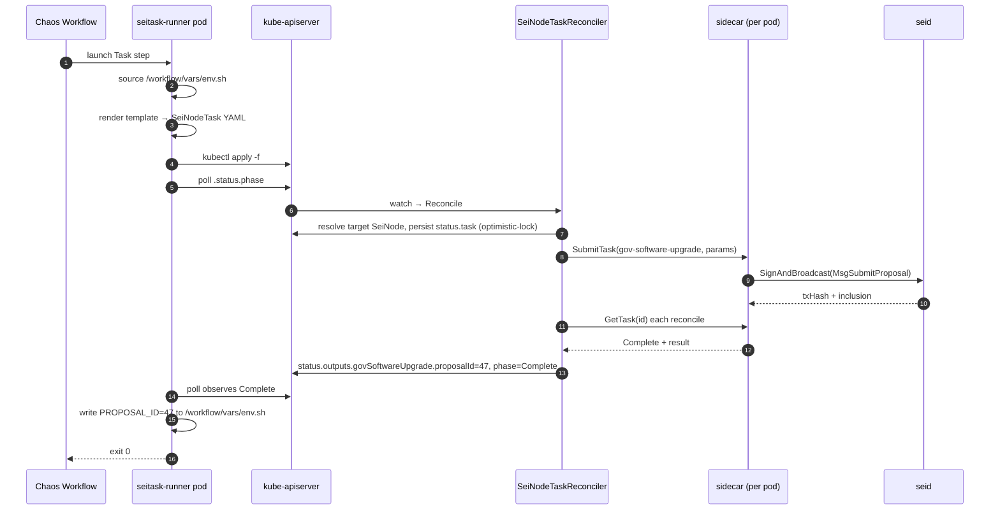

# SeiNodeTask — MVP (LLD)

## Status

Draft — 2026-05-19

## Authors

brandon@seinetwork.io

## Background

The `sei-chain/integration_test/` framework is a Python runner that `docker exec`s sequential `seid` bash steps against a 4-node docker-compose cluster, chains state via env-var pass-through, and asserts with `eval`/`regex` verifiers. It cannot express chain-upgrade orchestration that mixes node-image rollouts with on-chain transactions, fault injection inside a scenario, or runs against real K8s clusters.

The sei-k8s-controller already provisions real Sei clusters via `SeiNodeDeployment`/`SeiNode` CRDs and drives node lifecycle through a plan-driven `TaskExecution` machinery (`internal/planner/`, `internal/task/`). The seictl sidecar already exposes signed-tx handlers (`gov-vote`, `gov-software-upgrade`), `await-condition`, and the genesis-ceremony task family.

The missing primitive is a single-task CRD that surfaces individual operations as Kubernetes resources so a Chaos Mesh `Workflow` can compose them into test scenarios alongside chaos experiments.

## Goals

1. Express `integration_test/upgrade_module/major_upgrade_test.yaml` end-to-end as a Chaos Mesh Workflow of `SeiNodeTask` CRs. This is the MVP acceptance criterion.
2. Zero new task implementations at the sidecar for MVP — surface what `gov-vote`, `gov-software-upgrade`, and `await-condition` already do.
3. One new controller-side task — `update-node-image` — that patches `SeiNode.spec.image` and completes when the image lands on the pod.
4. Reuse `internal/task/` machinery verbatim. The new controller is a thin reconciler that wraps `task.Deserialize` + `Execute`/`Status` polling; it does not own a planner.

## Non-goals

- Fan-out targeting (label selector over multiple SeiNodes). Workflow composites express fan-out.
- A scenario DSL or CLI compiler.
- New transaction types beyond `gov-vote` / `gov-software-upgrade`.
- Generic chain-state queries (`QueryChainStateTask`).
- Verifier-as-its-own-task-kind. `AwaitCondition` covers "X within timeout"; output comparisons live at the Workflow expression layer.
- Mainnet keyring support. MVP uses existing `test`/`file`/`os` backends.
- Idempotency hardening beyond what the sidecar's task-result store already provides. The documented `gov-software-upgrade` crash-window double-broadcast (sei-protocol/seictl#174) is left to that issue.
- Cross-CR input/output via spec fields. The runner-container env-file bridge is the contract.

## Design

### CRD: `SeiNodeTask`

One CRD, discriminated union by `spec.kind`, CEL-enforced (mirrors the existing `SeiNodeSpec.fullNode|archive|replayer|validator` pattern). Each kind maps 1:1 to a task type in `internal/task/` — no polymorphic super-types.

```yaml
apiVersion: sei.io/v1alpha1
kind: SeiNodeTask
metadata:
  name: upgrade-proposal-v2
spec:
  kind: GovSoftwareUpgrade           # required; CEL enforces exactly one payload struct
  target:
    nodeRef: { name: validator-0 }   # single-node only
    requirePhase: Running            # default Running; fail-fast if not met within timeout
    requirePhaseTimeout: 5m
  timeoutSeconds: 600
  govSoftwareUpgrade:
    chainId: sei-localnet
    keyName: node_admin
    title: "Upgrade to v2.0.0"
    description: "..."
    upgradeName: v2.0.0
    upgradeHeight: 1500
    initialDeposit: 10000000usei
    fees: 2000usei
    gas: 500000
status:
  phase: Running | Complete | Failed
  task: { id, status, err }
  outputs:
    govSoftwareUpgrade:
      txHash: ABCD...
      height: 1442
      proposalId: 47               # extracted from tx response events
  observedGeneration: 1
  conditions: [Ready, Failed]
```

MVP kinds:

| `spec.kind` | Backing task type | Location |
|---|---|---|
| `GovSoftwareUpgrade` | `gov-software-upgrade` | sidecar (exists) |
| `GovVote` | `gov-vote` | sidecar (exists) |
| `AwaitCondition` | `await-condition` | sidecar (exists) |
| `UpdateNodeImage` | `update-node-image` | controller-side (new, this MVP) |
| `AwaitNodesAtHeight` | `await-nodes-at-height` | controller-side (exists) |

Adding a kind = struct + CEL line + registry deserializer entry. ~30 LOC + tests.

### Reconciler topology

Thin adapter, **not** a synthesized one-task plan through `planner.Executor`. The executor's plan walking and phase transitions impose ceremony that doesn't fit a one-shot CR.

```
SeiNodeTaskReconciler.Reconcile:
  1. Get CR. If status.phase terminal → no-op.
  2. Resolve target SeiNode by spec.target.nodeRef.name (same namespace).
     If target.status.phase != Running and spec.target.requirePhase=Running:
       - If now-firstObserved > requirePhaseTimeout → fail Terminal.
       - Else requeue.
  3. Build ExecutionConfig (same factory NodeReconciler uses).
  4. If status.task == nil:
       - Synthesize PlannedTask: id=UUIDv5(taskIDNamespace, CR.UID+"/"+spec.kind),
         type=mapped task type, params=serialized payload struct.
       - Persist status.task atomically (optimistic-lock Status().Patch). Requeue.
  5. Else:
       - task := task.Deserialize(status.task.type, status.task.id, params, cfg)
       - If status.task.status == Pending: task.Execute(ctx). Handle TerminalError.
       - sw := task.Status(ctx)
       - Mutate status.task.status; if terminal, populate status.outputs from a
         per-kind typed accessor against the sidecar task result.
       - Optimistic-lock Status().Patch. Requeue if Running.
```

Optimistic-locked status patches are mandatory (`CLAUDE.md`).

### Sidecar reuse — no new tx types in MVP

`SignAndBroadcast` (`seictl/sidecar/tasks/sign_and_broadcast.go`) already enforces the load-bearing safety properties: chain-ID guard against `SEI_CHAIN_ID` + `/status`, `usei`-only fees, memo length + non-printable validation, `taskID=<id>` memo tag for on-chain audit, persistent task-result store keyed by deterministic task ID. The MVP inherits all of this by construction.

### Output → input bridging

Chaos Mesh Workflow has no native parameter passing across `Task` steps (verified for 2.5/2.6/2.7). The MVP bridges via an `emptyDir` shared across the Workflow's runner containers at `/workflow/vars`:

- On success, each runner writes `KEY=value` lines (per `--output-jsonpath`) to `/workflow/vars/env.sh`.
- Every runner `source`s `/workflow/vars/env.sh` before template render.

The CRD's `.status.outputs.<kind>.<field>` is typed and stable; the bridge is a Workflow concern, replaceable when Chaos Mesh adds parameters or when we migrate to Argo.

### Runner container

One image: `seitask-runner` (distroless + `kubectl` + small Go binary). Args:

- `--template /templates/<kind>.yaml.tmpl`
- `--var KEY=VALUE` (repeatable)
- `--output-jsonpath '.status.outputs.govSoftwareUpgrade.proposalId=PROPOSAL_ID'` (repeatable)
- `--timeout`, `--poll-interval`

Behavior: render → `kubectl apply` → poll `.status.phase` until terminal → on `Complete`, run jsonpath extractions and append `K=V` lines to `/workflow/vars/env.sh` → exit 0/1.

Templates live in the controller repo. ServiceAccount bound to `create;get;watch` on `seinodetasks` only.

### Component flow



### `update-node-image` task

Controller-side. Idempotent.

1. Get owner-resolved SeiNode by `spec.target.nodeRef.name`.
2. If `spec.image != target.spec.image`: patch `target.spec.image = spec.image` (SSA, fieldOwner `seinode-task-controller`).
3. Poll `target.status.currentImage`. **Complete** when `currentImage == spec.image`. **No readiness check** — the major-upgrade scenario expects nodes to CrashLoop after early upgrade. Readiness is a separate `AwaitCondition` step.

### RBAC

- `sei.io/seinodetasks{,/status,/finalizers}`: full CRUD.
- `sei.io/seinodes`: `get;list;watch`, plus `patch` scoped to the `update-node-image` marker only.
- `pods`: `get;list;watch` for sidecar endpoint resolution.
- `events`: `create;patch`.
- No `pods/exec`.

## Alternatives

1. **Polymorphic `SubmitTxTask` with `txKind`-discriminated payload.** Rejected. The sidecar's "one handler per Msg type" pattern exists so each gets its own rehydration/idempotency analysis. A super-type erodes that contract.
2. **Reuse `planner.Executor` against a synthesized 1-task plan.** Rejected. Plan walking, phase transitions, and condition wiring are ceremony a one-shot CR doesn't need. Reuse lives at `internal/task/`, not `internal/planner/`.
3. **Verifiers as distinct CRD kinds (`VerifyNodeRunning`, `VerifyPanicked`).** Rejected. "Wait for X" and "assert X within timeout" collapse into `AwaitCondition`.
4. **Fan-out in CR spec (label selector).** Deferred. Workflow `Parallel`/`Serial` expresses it; in-CR fan-out forces controller-invented failure policies that belong to the scenario author.
5. **ConfigMap output side channel.** Rejected. Racy across runs, requires GC. emptyDir bridge is replaceable and scoped.

## Trade-offs

- **emptyDir bridge couples MVP to `Workflow.task.container.volumes`.** When Workflow shape diverges or we move to Argo, this layer is rewritten. CRD contract is untouched.
- **Per-Msg handler discipline slows the rate at which new tx kinds ship** — each new gov/staking/bank Msg is a sidecar handler PR + controller registry entry + CRD payload struct. Deliberate.
- **`update-node-image` completes on image-applied, not Ready.** Authors writing happy-path scenarios will be surprised the CR is `Complete` while the pod is pulling. Documented on the kind's CRD description.
- **No native parameter passing** means scenarios split across Workflow YAML + per-step env files. Acceptable for the handful of in-tree scenarios MVP targets.

## Open questions

1. **sei-protocol/seictl#174 timeline.** If the pre-broadcast txHash marker lands soon, MVP can rely on it; otherwise we ship with the documented `gov-software-upgrade` double-broadcast crash window.
2. **Sidecar SAR target.** The new reconciler's ServiceAccount needs the same SAR-permitted verb/resource that NodeReconciler binds to. Resolve when wiring kube-rbac-proxy auth.
3. **Default `requirePhaseTimeout`.** 5m is a guess; calibrate during major-upgrade prototyping.

## References

- Coral session 2026-05-19 (kubernetes-specialist, platform-engineer, product-engineer).
- North star: `sei-chain/integration_test/upgrade_module/major_upgrade_test.yaml`.
- Existing runner: `sei-chain/integration_test/scripts/runner.py`.
- Repo conventions: `sei-k8s-controller/CLAUDE.md`.
- Task interface: `sei-k8s-controller/internal/task/task.go`.
- Plan lifecycle (deliberately not reused): `sei-k8s-controller/internal/planner/doc.go`.
- Sidecar tx signing: `seictl/sidecar/tasks/sign_and_broadcast.go`.
- Sidecar handler wiring: `seictl/serve.go:107-127`.
- Sidecar `await-condition`: `seictl/sidecar/tasks/await_condition.go`.
- sei-protocol/seictl#174 (pre-broadcast txHash marker).
- Prior LLD style: `sei-k8s-controller/docs/design/validation-run-lld.md`.
- Chaos Mesh Workflow `Task.container` — free-form pod across 2.5/2.6/2.7.
